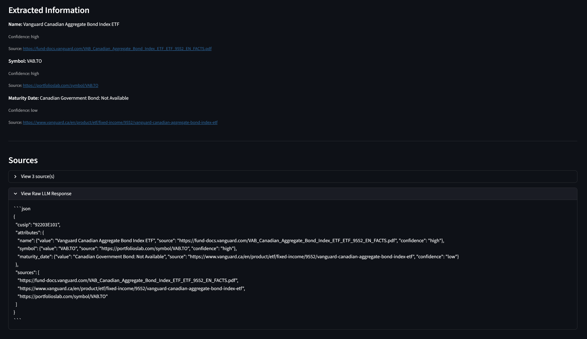

# CUSIP Financial Information Finder

A Streamlit-based web application that extracts comprehensive financial information about CUSIP securities using Google Gemini 2.0 with search grounding capabilities.


## Overview

This tool leverages Google Gemini 2.0's advanced AI capabilities combined with web search grounding to extract detailed financial information about any CUSIP security. It supports two distinct search modes and provides comprehensive tracing of the entire extraction process.

## Key Features

- **Dual Search Modes**
  - **Gemini Search Grounding**: Automatic AI-driven web search with intelligent result processing
  - **Custom Search API**: Fine-grained control over search results using Google Custom Search

- **Flexible Information Extraction**: Request any financial attribute you need
  - Maturity dates and weighted average maturity (WAM)
  - Coupon rates and yields
  - Credit ratings and issuer information
  - Par values and security types
  - And more - just ask for what you need

- **Comprehensive Source Citations**: Every piece of extracted data includes source URLs for verification

- **Detailed Processing Trace**: View step-by-step processing to understand exactly how information was found

- **PDF Document Support**: Searches and extracts data from PDF prospectuses, SEC filings, and other documents



## Technical Architecture

### Core Components

- **Google Gemini 2.0 Flash**: Production-grade LLM for intelligent information extraction
- **Search Grounding**: Real-time web search capability integrated with Gemini
- **Custom Search API**: Optional Google Custom Search integration for controlled results
- **Streamlit**: Modern Python web framework for the user interface

### How It Works

1. **Initialization**: Configure search mode (Gemini Search Grounding or Custom Search API)
2. **Search Phase**:
   - Gemini mode: AI autonomously searches the web for relevant information
   - Custom Search mode: Pre-fetch results from Google Custom Search, then provide to Gemini
3. **Prompt Construction**: Build dynamic prompts based on requested attributes
4. **AI Processing**: Gemini analyzes search results and extracts structured information
5. **Source Extraction**: Collect and deduplicate all source URLs
6. **Result Presentation**: Display extracted data with confidence levels and sources

## Installation

### Prerequisites

- Python 3.8 or higher
- Google AI Studio API key ([Get one here](https://aistudio.google.com/app/apikey))
- (Optional) Google Custom Search API credentials for Custom Search mode

### Setup

1. Clone the repository:
```bash
git clone <repository-url>
cd cusip-wam-pipeline
```

2. Install dependencies:
```bash
pip install -r requirements.txt
```

3. (Optional) Create a `.env` file for your API keys:
```bash
GOOGLE_API_KEY=your_gemini_api_key_here
CUSTOM_SEARCH_ENGINE_ID=your_search_engine_id_here
CUSTOM_SEARCH_API_KEY=your_custom_search_key_here
```

4. Run the application:
```bash
streamlit run app.py
```

## Usage Guide

### Basic Usage (Gemini Search Grounding)

1. Enter your Google AI Studio API key in the sidebar
2. Enter a CUSIP number (e.g., `912828Z29`)
3. Specify the information you want to find (one per line):
   ```
   maturity date
   coupon rate
   yield
   issuer name
   ```
4. Click "Analyze" to start the extraction process
5. View results with extracted information and source citations

### Advanced Usage (Custom Search API)

1. Check "Use Custom Search API" in the sidebar
2. Enter your Custom Search Engine ID
3. Enter your Custom Search API key
4. Follow the same steps as basic usage

The Custom Search mode gives you more control over which websites are searched and how results are prioritized through your Custom Search Engine configuration.

## Search Modes Explained

### Gemini Search Grounding (Default)

- Gemini autonomously searches the web
- AI-driven result selection and processing
- No additional API keys required
- Best for: General use, quick queries, trusting AI judgment

**Workflow:**
```
User Query → Gemini Search Grounding → AI Extracts Data → Results
```

### Custom Search API

- Pre-fetch results using Google Custom Search
- Provide search results as context to Gemini
- Fine-grained control via Custom Search Engine configuration
- Best for: Specific data sources, compliance requirements, result control

**Workflow:**
```
User Query → Custom Search API → Results → Gemini Extracts Data → Results
```

## API Keys and Configuration

### Google AI Studio API Key

Required for all operations. Get it from [Google AI Studio](https://aistudio.google.com/app/apikey).

### Custom Search API (Optional)

Required only if using Custom Search mode:

1. **Custom Search Engine ID** (`cx` parameter):
   - Create a Custom Search Engine at [Google Programmable Search](https://programmablesearchengine.google.com/)
   - Configure which sites to search or search the entire web
   - Copy the Search Engine ID

2. **Custom Search API Key**:
   - Enable Custom Search API in [Google Cloud Console](https://console.cloud.google.com/)
   - Create API credentials
   - Copy the API key

## Project Structure

```
cusip-wam-pipeline/
├── app.py                      # Streamlit frontend
├── requirements.txt            # Python dependencies
├── assets/                     # Screenshots and images
├── src/
│   ├── services/
│   │   ├── gemini_client.py   # Gemini API integration
│   │   └── pipeline.py        # Processing pipeline
│   ├── models/
│   │   └── schemas.py         # Data structures
│   └── utils/
│       └── validators.py      # CUSIP validation
└── tests/                     # Unit tests
```

## Dependencies

- **streamlit**: Web application framework
- **google-generativeai**: Google Gemini API client
- **requests**: HTTP library for Custom Search API
- **python-dotenv**: Environment variable management

See [requirements.txt](requirements.txt) for specific versions.

## Processing Trace Example

The application provides detailed trace output showing each step:

```
STEP 1: INITIALIZATION
  • CUSIP: 912828Z29
  • Search Mode: Custom Search API
  • Requested Attributes: maturity date, coupon rate, yield

STEP 2: CUSTOM SEARCH API
  • Query: 'CUSIP 912828Z29 maturity date coupon rate yield'
  • Search completed: 1,234 results in 0.42s
  • Retrieved 10 search result(s)

STEP 3: PROMPT CONSTRUCTION
  • Prompt length: 2,847 characters
  • Requested attributes: maturity date, coupon rate, yield

STEP 4: GEMINI AI PROCESSING
  • Model: gemini-2.0-flash
  • Mode: Custom Search (results pre-fetched)
  • Response received successfully

STEP 5: SOURCE EXTRACTION
  • Gemini grounding sources: 3
  • Custom search sources: 10
  • Total unique sources: 12
```

## Supported Attributes

You can request any financial attribute. Common examples:

- Maturity date / Maturity dates
- Weighted Average Maturity (WAM)
- Coupon rate
- Yield / Yield to maturity
- Credit rating
- Issuer name
- Issue date
- Par value / Face value
- Security type
- Principal amount
- ISIN number
- Bloomberg ticker

Just type what you need - the AI will attempt to find it.

## Error Handling

The application handles various error scenarios:

- Invalid CUSIP format
- API authentication failures
- Network timeouts
- Missing or incomplete data
- PDF parsing errors

All errors are logged and displayed to the user with helpful messages.

## Performance Considerations

- **Response Time**: Typically 5-15 seconds depending on search complexity
- **Rate Limits**: Subject to Google AI Studio and Custom Search API quotas
- **Accuracy**: Dependent on availability of public information and AI interpretation

## Limitations

- Information accuracy depends on publicly available data
- Some CUSIPs may have limited online information
- PDF documents may have inconsistent formatting
- Custom Search API limited to 10 results per request
- Subject to Google API rate limits and quotas

## Security Notes

- API keys are never stored or logged
- All API communication uses HTTPS
- Session state is maintained only during active sessions
- No persistent storage of queries or results

## Troubleshooting

**Error: "API key not valid"**
- Verify you're using the correct API key for each service
- Gemini requires Google AI Studio API key
- Custom Search requires separate Custom Search API key

**Error: "No attributes extracted"**
- Try rephrasing your attribute requests
- Check if the CUSIP has publicly available information
- Try the other search mode (Gemini vs Custom Search)

**Slow performance**
- Normal for complex queries with multiple attributes
- Custom Search mode may be faster for specific queries
- Check your internet connection

## Example CUSIPs for Testing

- `912828Z29` - U.S. Treasury Security
- `037833100` - Apple Inc. Bond
- `594918104` - Microsoft Corp Bond

## Contributing

Contributions are welcome! Areas for improvement:

- Additional data source integrations
- Enhanced PDF parsing
- Batch CUSIP processing
- Export functionality (CSV, Excel)
- Historical data tracking

## License

This project is provided as-is for educational and research purposes.

## Acknowledgments

- Built with Google Gemini 2.0 Flash
- Powered by Streamlit
- Uses Google Custom Search API (optional)

---

**Note**: This tool is for informational purposes only. Always verify financial information from official sources before making investment decisions.
